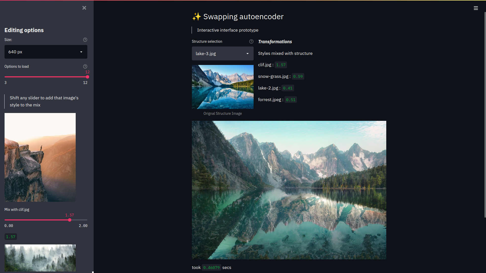

# Swapping Autoencoder

<p align="center">
<b> An interactive interface for swapping autoencoder</b>
</p>

<p align="center">


</p>

## 💡 Project Description

Our project build on the paper [Swapping Autoencoder for Deep Image Manipulation](https://arxiv.org/abs/2007.00653) by [Taesung Park](http://taesung.me/), [Jun-Yan Zhu](https://www.cs.cmu.edu/~junyanz/), [Oliver Wang](http://www.oliverwang.info/), [Jingwan Lu](https://research.adobe.com/person/jingwan-lu/), [Eli Shechtman](https://research.adobe.com/person/eli-shechtman/), [Alexei A. Efros](http://www.eecs.berkeley.edu/~efros/), [Richard Zhang](https://richzhang.github.io/). Our goal with this project was to make it easier for artists to use it as a tool. In that effort, we have introduced 3 interfaces to interact with a pre-trained model and edit images.

## 📺 Preview

<div align="center">
  
</div>

<p float="left">
  
  
  
</p>

## 📌 Prerequisites

### 💻 System requirement :

1. Nvidia GPU with + CUDA.
2. Operating System : Any (Windows / Linux / Mac).

### 💿 Software requirement :

1. python 3.8
2. poetry (Check out poetry [here](https://python-poetry.org/))

## Installation 🔧

### Step One - install python dependencies

```shell
$ poetry install
```

### Step Two - Download pretrained models

Head over to the [Testing and Evaluation section](https://github.com/taesungp/swapping-autoencoder-pytorch#testing-and-evaluation) of the official implementation of the paper and download the pretrained models and unzip them, put the checkpoints at `./checkpoints/`, you can change this location by specifying it at [`api/const.py:7`](https://github.com/saxenabhishek/swapping-autoencoder-pytorch/blob/febc81d644847324fb78a3414b97f330bfe84021/api/const.py#L7)

## 🏁 Quick Start

**Streamlit Interface**

```sh
$ streamlit run streamlit_interface.py
```

## 📦 Inside the box

Checkout our [wiki](https://github.com/saxenabhishek/swapping-autoencoder-pytorch/wiki) for more details

## 📜 License

`saxenabhishek/swapping-autoencoder-pytorch` is available under the MIT license. See the LICENSE file for more info.

## 🤝 Contributing

Please read [`Contributing.md`](https://github.com/SRM-IST-KTR/template/blob/main/Contributing.md) for details on our code of conduct, and the process for submitting pull requests to us.

## ⚙️ Maintainers

| <p><br>[Abhishek Saxena](https://github.com/saxenabhishek)</p><p><br>[Adarsh Srivastava](https://github.com/theAdarshSrivastava)</p>|
| ---------------------------------------------------------------------------------------------------------------------------------------------- |

## 💥 Contributors

<a href="https://github.com/saxenabhishek/swapping-autoencoder-pytorch/graphs/contributors">

</a>
